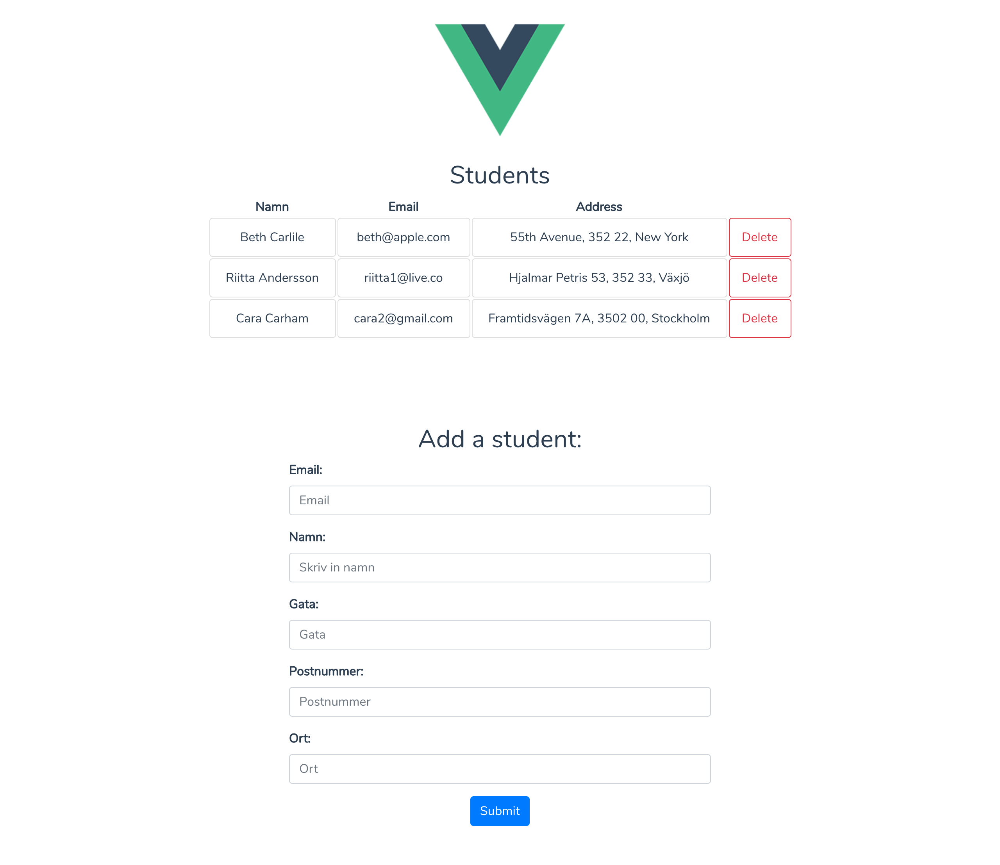

# Marcus Andersson - inlämningsuppgfit 1




## Instructions

```
Go inside server folder and run:

npm install 
->
npm run dev
```
```
Go inside vue-app folder and run:

npm install 
->
npm run serve
```
---

* GET
```
curl localhost:3000/students | jq
```

* GET {_id}
```
curl localhost:3000/students/_id | jq
```

* GET with params
```
curl -X GET "localhost:3000/students?name=Charlie+Carham" | jq
```

* POST
```
curl -X POST "localhost:3000/students" -H "accept: application/json" -H "Content-Type: application/json" -d '{
    "student": {
      "email": "becca.karlsson@live.com",
      "name": "Rebecca Karlsson",
      "address": {
        "gata": "Storgatan 11B",
        "postnummer": "341 40",
        "ort": "Göteborg"
        }
      }
    }' | jq
```

* PATCH
```
curl -X PATCH "localhost:3000/students/5cee5fa894a20c8468237593" -H "accept: application/json" -H "Content-Type: application/json" -d '{
    "student": {
      "email":"calle@live.com",
      "name": "Calle Karlsson",
      "address": {
        "gata": "Högstorp 35A",
        "postnummer":"555 33",
        "ort":"Växjö"
        }
      }
    }' -i
```

* DELETE
```
curl -X DELETE "localhost:3000/students/5ce923a558184a53e0983652" -i
```

* PUT
```
 curl -X PUT "localhost:3000/students/5cefac22335dfb8664fc1597" -H "accept: application/json" -H "Content-Type: application/json" -d '{
   "student": {
      "email":"carham@mail.com",
      "name": "Cara Carham",
      "address": {
        "gata": "Carstreet 10",
        "postnummer":"353 33",
        "ort":"Cartown"
        }
      }
    }' -i
```
---
## Teoretisk del:
**Hur används HTTP-protokollet när du surfar in på en websida? Beskriv vilken metod, path, URI, response code och body som skickas in och svarar. Om du har svårt att bestämma dig för en url, ta ex. http://www.smp.se/kultur-noje/**
```
När jag går in på http://www.smp.se/kultur-noje/ så skickar klienten en GET-metod (HTTP-förfrågan). -> Servern tar emot förfrågan och skickar sedan tillbaka HTML (response code) till klienten. Pathen är /kultur-noje/
```

**Beskriv HTTP-protokollets vanligaste metoder och vad de gör.**
```
GET: Förfrågan till servern där man pekar på en fil/url.
POST: Skapar ett nytt objekt.
PUT: Om man skickar med ett specifikt _id så ändras det objektet, annars så skapas det ett nytt.
DELETE: Raderar objektet.
PATCH: Uppdaterar hela ELLER en viss del av ett objekt
```

**"http://localhost:3000/users?username=something" är en URI, beskriv vilka delar den består av och vad de kallas.**
```
Schema: "http"
Authority: "localhost:3000"
Path: "/users"
Query = "?username=something"
```

**På vilka tre sätt kan man skicka in parametrar i en HTTP-request? Ge exempel med curl.**
```
Med query:
curl -X GET "localhost:3000/students?name=Charlie+Carham" | jq
```

```
Med path:
curl -X GET "localhost:3000/students" | jq
```

```
Med header:
curl -X GET "http://localhost:3000/students?name=Carham" -H "Content-Type: application/json" | jq
```
## Feedback:
De första dagarna så gick det lite väl fort, men det kanske var för att det var så mycket ny information på en och samma gång. Något jag gillar är att du live-kodar och går igenom de olika exemplen! Ingen gillar långa teoripass (snark), så korta föreläsningar mixat med övningar efteråt! Annars gillar jag upplägget! I början kände jag mig ganska lost, men ju mer jag satt med det, ju mer förstod jag. Och nu har poletten äntligen trillat ner! :-) Ser fram emot resten av kursen!
